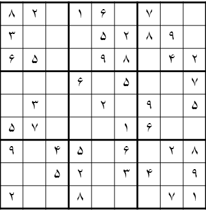
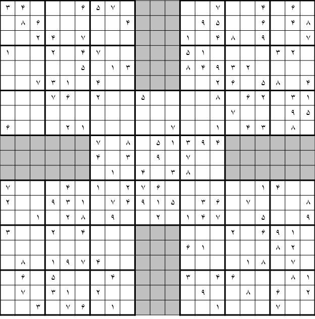

# A command-line Sudoku Generator
Generates a Sudoku puzzle (either a **normal** sudoku or a **Samurai** sudoku) and outputs it either as **plain-text** or as **a raster image**.

An example of a **normal** sudoku generated using this tool (represented as **plain-text**):

```
005|460|918
910|000|302
082|031|005
-----------
093|005|207
200|000|190
871|309|004
-----------
129|050|406
007|006|831
308|107|009
```

An example of a **Samurai** sudoku generated using this tool (represented as **plain-text**):

```
103|605|208     007|902|000
457|108|096     890|005|700
600|490|070     641|873|905
-----------     -----------
700|080|409     900|520|478
240|009|001     400|030|009
809|004|652     765|409|031
-----------     -----------
502|900|803|074|150|704|302
300|807|020|180|000|000|004
904|002|007|003|084|301|007
        -----------
        600|500|002
        080|360|005
        005|907|408
        -----------
400|060|090|700|501|000|900
300|748|050|430|807|596|340
008|005|700|051|600|800|005
-----------     -----------
892|001|075     759|000|612
030|920|680     430|105|000
600|084|920     008|907|403
-----------     -----------
206|410|007     906|018|530
740|006|010     010|700|000
910|803|264     084|600|020
```

An example of a **normal** sudoku generated using this tool (represented as **a PNG image**):



An example of a **Samurai** sudoku generated using this tool (represented as **a PNG image**):



